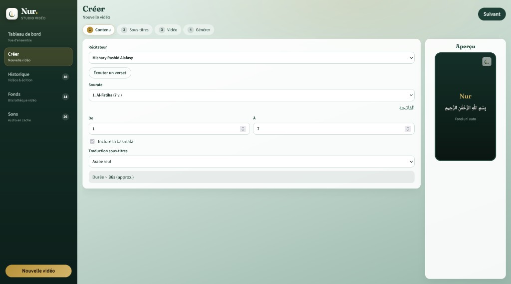
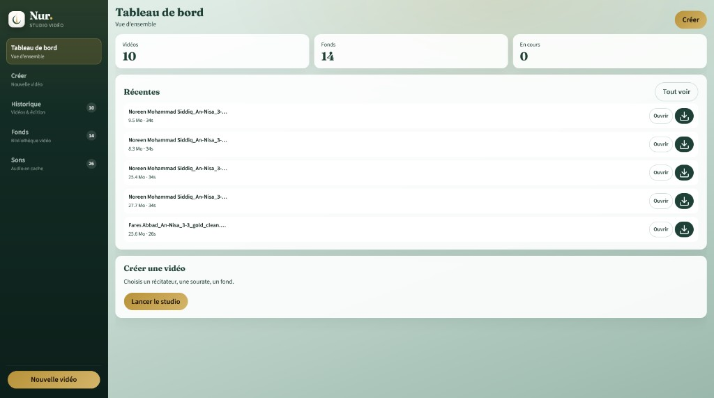
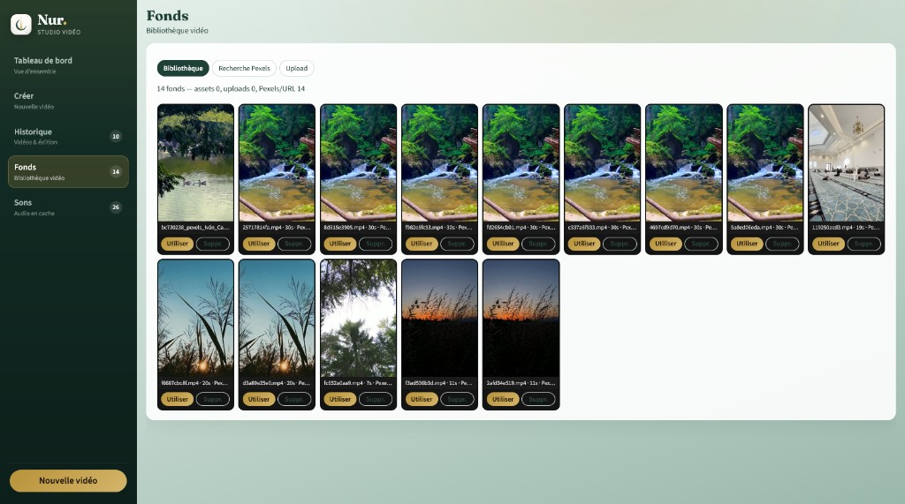
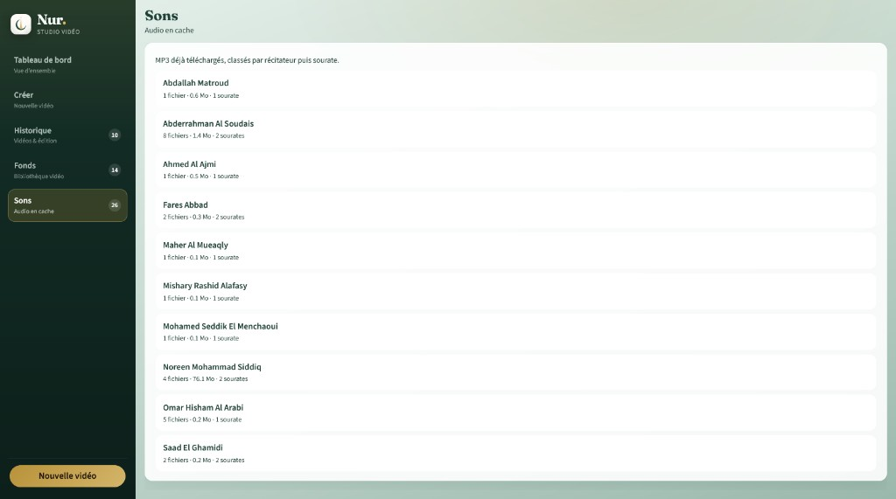

# Nur — Studio Vidéo Coranique

<p align="center">
  
</p>

**Nur** est une application web locale qui transforme une récitation du Coran en vidéo verticale prête pour TikTok, Reels ou Shorts. Tu choisis un récitateur, une sourate et des versets : Nur télécharge l’audio, synchronise les sous-titres arabes (avec traduction française ou anglaise si tu veux), compose le fond vidéo, grave le logo Nur, et exporte un MP4 en 1080×1920.

Le tout se pilote depuis un vrai studio : tableau de bord, historique, bibliothèque de fonds (Pexels, upload), cache audio classé, puis trim et montage une fois la vidéo générée. Aucun compte distant — tout tourne sur ta machine.



---

## En bref

- **Récitation** — récitateur, sourate, intervalle de versets, aperçu audio
- **Sous-titres** — arabe seul ou bilingue (FR / EN), styles, animations, versets longs
- **Vidéo** — fonds Pexels / upload / bibliothèque, styles de rendu, watermark Nur obligatoire
- **Studio** — dashboard, historique, crédits en bas, trim & assemblage, sons en cache

---

## Aperçu de l’interface

### Tableau de bord

Vue d’ensemble : vidéos récentes, fonds, file d’attente, accès rapide au studio.



### Fonds

Bibliothèque de fonds : recherche Pexels → **Ajouter**, puis **Utiliser** pour charger le fond dans une création.



### Sons

Audio déjà téléchargé, classé par récitateur puis sourate — prêt à réécouter sans re-télécharger.



---

## Prérequis

1. **Python 3.10+**
2. **Node.js 18+**
3. **ffmpeg** et **ffprobe** dans le `PATH`
   - Windows : [builds Gyan](https://www.gyan.dev/ffmpeg/builds/) (essentials) → ajouter le dossier `bin/` au PATH
   - Vérifie : `ffmpeg -version` et `ffprobe -version`

---

## Installation (une seule fois)

```powershell
cd F:\others\Tiktok
python -m pip install -r backend\requirements.txt
cd frontend
npm install
cd ..
```

---

## Lancer l’app

**Windows** — double-clic sur `start.bat`, ou :

```powershell
cd F:\others\Tiktok
.\start.bat
```

| Script | Environnement |
|--------|----------------|
| `start.bat` / `start.ps1` | Windows |
| `start.sh` | Git Bash / macOS / Linux |

Puis ouvre **http://localhost:5173**  
(API locale : `http://127.0.0.1:8000`)

### Clé Pexels (optionnel)

Pour la recherche de fonds dans l’onglet **Fonds → Recherche Pexels** :

1. Crée une clé gratuite : [pexels.com/api](https://www.pexels.com/api/)
2. Avant de lancer :

```powershell
$env:PEXELS_API_KEY = "ta_cle"
.\start.ps1
```

Ou place `PEXELS_API_KEY=...` dans un fichier `.env` à la racine du projet.

---

## Premier essai (≈ 1 minute)

1. **Créer** → récitateur (ex. Alafasy) → sourate courte (**Al-Ikhlas 112**, versets 1–4)
2. **Sous-titres** → style Or ou Classique
3. **Vidéo** → style Épuré, ou **Utiliser** un fond depuis **Fonds**
4. **Générer** → attendre la progression → **Télécharger**

Astuce : les MP3 restent en cache (`cache/audio/`) et les vidéos sortent dans `outputs/`.

---

## Navigation du studio

| Page | Rôle |
|------|------|
| **Tableau de bord** | Stats, vidéos récentes, file d’attente |
| **Créer** | Wizard Contenu → Sous-titres → Vidéo → Générer |
| **Historique** | Prévisualiser, télécharger, trimmer, assembler |
| **Fonds** | Bibliothèque, Pexels, upload — **Utiliser** = fond de création |
| **Sons** | MP3 déjà téléchargés, classés par récitateur / sourate |

Le logo **Nur** est toujours gravé sur les vidéos (pas d’option pour le retirer).  
Option **crédits bas** : sourate + versets sur une ligne, récitateur en dessous.

---

## Structure du projet

```
Nur/
├── backend/app/     API FastAPI + pipeline ffmpeg
├── frontend/        UI Vite + React (dashboard)
├── assets/          Logo Nur, polices, fonds locaux
├── cache/audio/     Cache MP3 par récitateur
├── cache/fonds_url/ Fonds téléchargés (Pexels / URL)
├── outputs/         Vidéos générées (+ sidecars JSON / SRT)
├── docs/            Captures d’écran
└── start.bat        Lance API + frontend
```

---

## Dépannage rapide

| Problème | Piste |
|----------|--------|
| « API inaccessible » | Relance `start.bat` ; vérifie le port **8000** |
| ffmpeg introuvable | Réinstalle les essentials et rouvre le terminal |
| Recherche Pexels vide | Manque `PEXELS_API_KEY` dans l’environnement |
| Génération bloquée | Un seul worker mémoire : ne pas lancer l’API avec `reload=True` |

---

Nur — usage personnel · récitations publiques · fond libre / Pexels selon leurs licences
